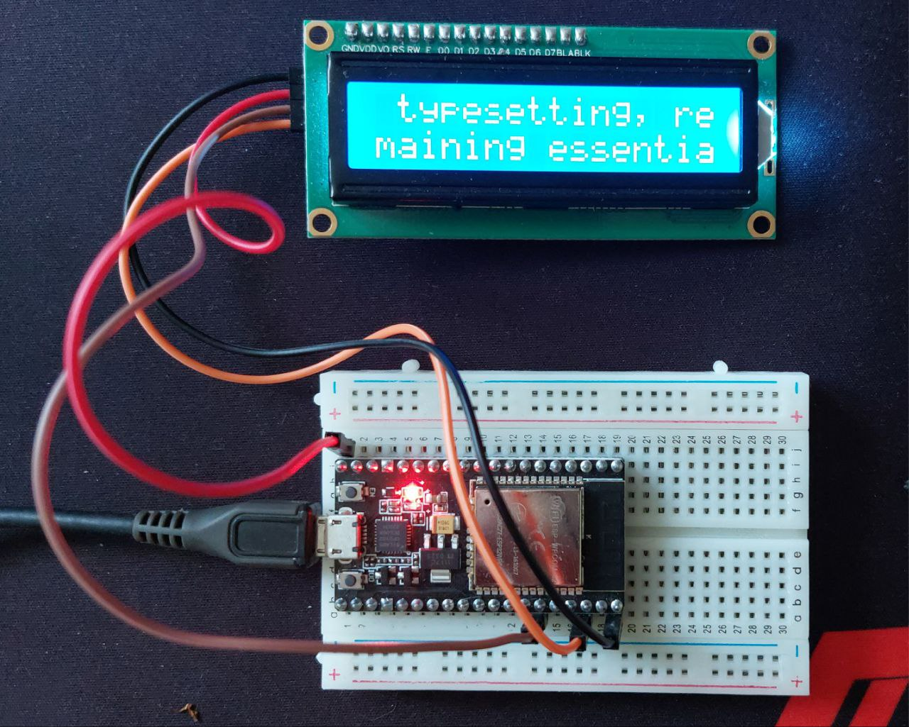

# LCD1602_PCF8574 Library for ESP32


This library provides a comprehensive interface for controlling an LCD display connected to an ESP32 via I2C. It allows for basic text output, clean text, backlight management, custom character creation, and text scrolling.



## Features

- **Text Display**: Easily write text to specified lines and positions on the LCD.
- **Backlight Control**: Manage the backlight of the LCD, allowing it to be turned on or off.
- **Custom Characters**: Design and display your own custom characters on the LCD.
- **Text Scrolling**: Implement both horizontal and vertical text scrolling.

## Installation

Clone this repository to your local machine to get started with the LCD library:

```bash
git clone https://github.com/evmar99/ESP32-LCD1602-PCF8574-library
```

## Hardware Connection

To connect the LCD to an ESP32, follow these steps:

1. **VCC** - Connect to a 5V or 3.3V pin on the ESP32.
2. **GND** - Connect to a ground pin on the ESP32.
3. **SDA** - Connect to the I2C data pin (default is GPIO 21 on ESP32).
4. **SCL** - Connect to the I2C clock pin (default is GPIO 22 on ESP32).
5. **Backlight** (optional) - Some LCD modules include a pin to control the backlight, which you can connect to a digital pin on ESP32 if you want to control it programmatically.

Make sure that your LCD is compatible with the voltage levels provided by the ESP32. Most LCD displays operate at 5V, but 3.3V versions are also available.

## Usage

**Initializing the LCD**

To use the library, you first need to set up the I2C connection and initialize the LCD:

```python
from machine import I2C, Pin
from LCD1602_PCF8574 import LCD

# Set up I2C connection
i2c = I2C(1, scl=Pin(22), sda=Pin(21))

# Initialize the LCD
lcd = LCD(i2c, address=0x27, backlight_enabled=True, display_width=16)
```

## Writing Text

You can display text on the LCD by specifying the text, line, and position:

```python
# Display text on the first line, starting from position 0
lcd.write("Hello, World!", line=1, position=0)

```

## Scrolling Text

To scroll text across the display:

```python
# Scroll text on the second line to left 
lcd.scroll_text_left("Scrolling text left!", line=2, delay=0.3, repeat=1)
# Scroll text on the second line to right
lcd.scroll_text_right("Scrolling text right!", line=2, delay=0.3, repeat=1)
# Scroll text vertical
lcd.scroll_text_vertical("Scrolling text vertical!", line=2, delay=0.3, repeat=1)
```

## Creating and Displaying Custom Characters

Create custom characters and display them on the LCD:

```python
# Define a custom character (e.g., a heart)
heart = [0x00, 0x0A, 0x1F, 0x1F, 0x1F, 0x0E, 0x04, 0x00]
lcd.create_char(0, heart)

# Display the custom character at line 1, position 5
lcd.write_char_by_name('heart', line=1, position=5)
```

## Controlling the Backlight

Toggle the backlight on or off:

```python
# Turn on the backlight
lcd.toggle_backlight(True)

# Turn off the backlight
lcd.toggle_backlight(False)
```

## Contributing

Contributions are welcome! Feel free to fork this repository, make changes, and submit pull requests. If you find any issues or have suggestions for improvements, please open an issue.


